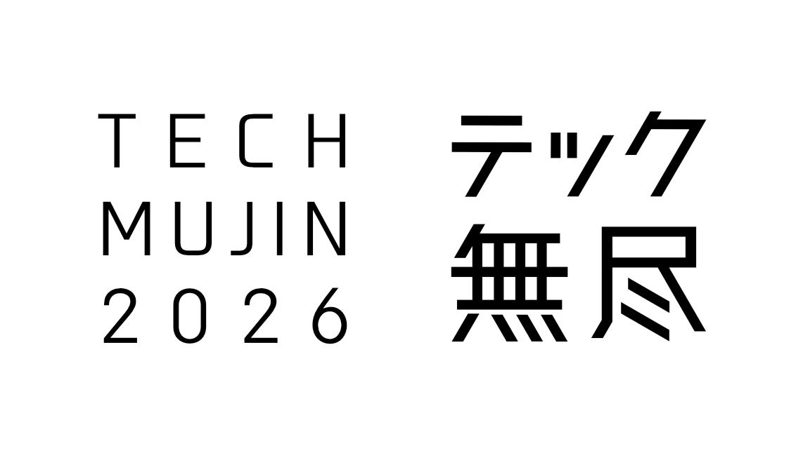

# テック無尽 2026

## 山梨ITコミュニティ合同イベント

---

## 企画書

<dl class="cover-meta">
<dt>開催日</dt><dd>2026年11月22日（日）</dd>
<dt>開催時間</dt><dd>10:00〜18:00（仮）</dd>
<dt>会場</dt><dd>山梨大学 甲府キャンパス 共創環境棟 治ホール</dd>
<dt>開催形式</dt><dd>現地開催</dd>
<dt>想定参加者数</dt><dd>100名</dd>
<dt>参加費</dt><dd>無料（予定）</dd>
<dt>主催</dt><dd>テック無尽</dd>
<dt>公式Webサイト</dt><dd><a href="https://techmujin.jp/">https://techmujin.jp/</a></dd>
<dt>更新日</dt><dd>2026年8月10日</dd>
<dt>バージョン</dt><dd>v2.0</dd>
</dl>

---

